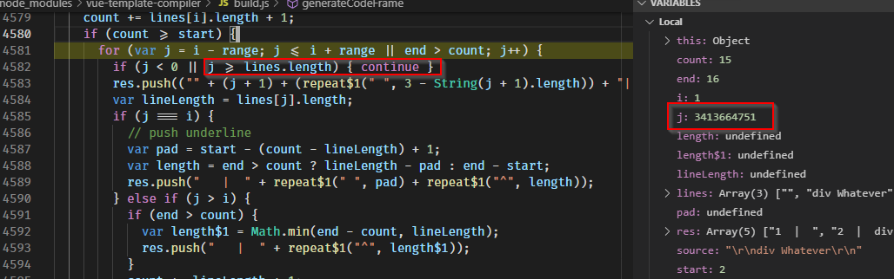

# To reproduce

```
npm i
npm start   (or just hit F5 if you're using vscode)
```

Wait a couple of seconds, and your compilation process will be frozen.

If you attach a debugger to the node process, you will see the infinite loop in `generateCodeFrame()` method of vue-template-compiler:

